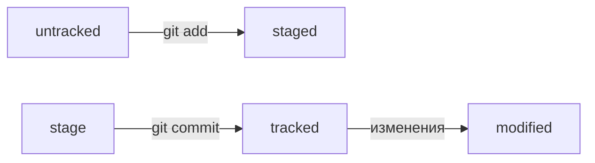

# **Шпаргалка по Git**
---

## **Навигация**

* `pw`- покажи, в какой я папке;

* `ls`- покажи файлы и папки в текущей папке;

* `ls -a`-  покажи также скрытые файлы и папки, названия которых начинаются с символа `.`;

* `cd`- перейди в папку;

* `cd ..`- перейди на уровень выше, в родительскую папку;

* `cd ~`- перейди в домашнюю директорию;

* `cd /`- перейди в корневую директорию.

## **Работа с файлами**

### **Создание**
* `touch`- создай файл в текущей папке;

* `mkdir`— создай папку с именем в текущей папке.

### **Копирование и перемещение**

* `cp`-скопируй файл в другое место;

* `mv`-перемести файл или папку в другое место.

### **Чтение**

* `cat`-распечатай содержимое текстового файла file.txt.

### **Удаление**

* `rm`-удали файл;

* `rmdir`-удали папку;

* `rm -r`-удали папку и всё, что она содержит.

### **Жизненный цикл файлов**

* `untracked` -файл, о существовании которого Git знает, но не следит за изменениями в нём;

* `tracked` -файл, о существовании которого Git знает и следит за изменениями в нём;

* `staged` -файл готовый к коммиту;

* `modified` -файл был изменен;

